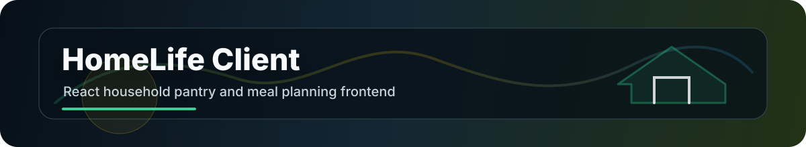
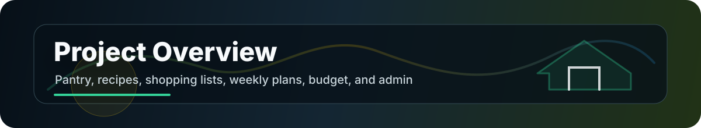
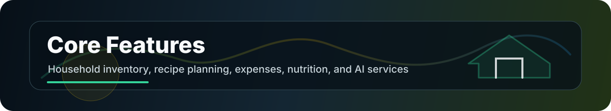

<br>

## License

This project is open source and available for educational use.

<br><br>
<!-- project overview -->


> Client-Side HomeLife is a React + TypeScript frontend for managing household food, recipes, shopping, meal plans, budgets, and user accounts.<br>
> It connects to a Laravel HomeLife API and provides protected household workflows, admin access, reusable modals, service modules, and React Query hooks.

<br>
<!-- system design -->


### Application Architecture

| Layer | Purpose |
|------|---------|
| **React 19** | Component-based household management interface |
| **TypeScript** | Typed state, services, hooks, and page data |
| **Vite** | Fast local development and production builds |
| **React Router** | Public, protected, and admin-only routes |
| **React Query** | Server state fetching, caching, and mutation hooks |
| **Axios Service Layer** | Central API wrapper with auth token injection |
| **Context Providers** | Authentication and app-level state |

<br>

### Repository Map

| Path | Description |
|-----|-------------|
| `src/App.tsx` | Route definitions for public, protected, and admin pages |
| `src/pages` | Landing, auth, home, pantry, recipes, shopping, weekly plan, budget, profile, and admin screens |
| `src/services` | API modules for auth, pantry, recipes, ingredients, shopping lists, meal plans, budget, admin, AI, insights, nutrition, units, and households |
| `src/hooks` | React Query hooks for pantry, recipes, shopping lists, expenses, meal plans, admin, and query keys |
| `src/components` | Route guards, dashboard navigation, modals, alerts, and confirmations |
| `src/context` | Auth and application context providers |
| `src/utils` | Date helpers and ingredient availability utilities |
| `src/types` | Shared TypeScript types |
| `src/styles` | Shared style files |

<br><br>
<!-- core features -->


### Core Features

- **Authentication**: Login, registration, auth context, protected routes, and bearer token API calls.<br>
- **Pantry management**: Track household items, quantities, locations, and expiration dates.<br>
- **Recipe management**: Create and manage recipes, ingredients, and nutrition-related data.<br>
- **Shopping lists**: Build shopping lists manually or from missing recipe ingredients.<br>
- **Weekly meal planning**: Schedule meals across a weekly plan view.<br>
- **Budget tracking**: Track expenses by store/category and monitor household spending.<br>
- **Profile page**: Manage user and household-facing account data.<br>
- **Admin page**: Admin-only route and admin service/hook support.<br>
- **AI and insights services**: Dedicated service modules for AI assistance and household insights.<br>
- **Reusable UI primitives**: Modal, confirm modal, alert modal, dashboard nav, protected route, and admin route components.<br>

<br>

### Main Routes

| Route | Screen |
|------|--------|
| `/` | Landing page |
| `/login` | Login |
| `/register` | Register |
| `/home` | Protected home dashboard |
| `/pantry` | Protected pantry |
| `/shopping` | Protected shopping lists |
| `/weekly-plan` | Protected weekly meal plan |
| `/profile` | Protected profile |
| `/recipes` | Protected recipes |
| `/budget` | Protected budget |
| `/admin` | Admin-only dashboard |

<br>
<!-- local setup -->


### Prerequisites

| Tool | Version |
|------|---------|
| Node.js | 18+ |
| npm | Current stable |
| Backend | HomeLife Laravel API running locally |

<br>

### Install and Run

```bash
npm install
npm run dev
```

Default dev URL:

```text
http://localhost:5173
```

<br>

### Backend API URL

The frontend reads the API URL from `VITE_API_URL` and falls back to:

```text
http://127.0.0.1:8000/api/v0.1
```

Create a local `.env` when needed:

```bash
VITE_API_URL=http://127.0.0.1:8000/api/v0.1
```

<br>

### Build Commands

```bash
npm run build
npm run lint
npm run preview
```

<br><br>
<!-- frontend map -->


### Service Areas

| Service | Purpose |
|--------|---------|
| `auth.service.ts` | Authentication requests |
| `pantry.service.ts` | Pantry inventory API calls |
| `recipes.service.ts` | Recipe API calls |
| `ingredients.service.ts` | Ingredient data |
| `shoppingList.service.ts` | Shopping list workflows |
| `mealPlan.service.ts` | Weekly plan workflows |
| `budget.service.ts` | Expenses and budget tracking |
| `household.service.ts` | Household data |
| `admin.service.ts` | Admin operations |
| `ai.service.ts` | AI-assisted features |
| `insights.service.ts` | Household insights |
| `nutrition.service.ts` | Nutrition support |
| `units.service.ts` | Unit/reference support |

<br>

### Key Dependencies

| Package | Purpose |
|---------|---------|
| `react` / `react-dom` | UI runtime |
| `react-router-dom` | Routing |
| `@tanstack/react-query` | Server state |
| `axios` | HTTP requests |
| `lucide-react` | Icons |
| `vite` | Dev server and build tool |
| `typescript` | Static typing |
| `eslint` | Code linting |

<br><br>
<!-- growth path -->


### Future Expansion

| Area | Direction |
|-----|-----------|
| Offline support | Cache pantry and shopping list flows for grocery trips |
| UX polish | Add denser empty states, loading states, and mobile-first list actions |
| Insights | Surface expiration risk, spending trends, and ingredient usage patterns |
| AI planning | Generate meal plans from pantry availability and budget constraints |
| Testing | Add route, hook, and service tests |
| Accessibility | Audit modals, forms, keyboard flow, and contrast |
| Deployment | Add production environment and API deployment notes |

<br>

---

**Client-Side HomeLife** - React and TypeScript household management frontend for pantry, recipes, shopping lists, meal planning, budgets, admin tools, and API-driven insights.

*A practical home operating system for food, planning, and spending.*